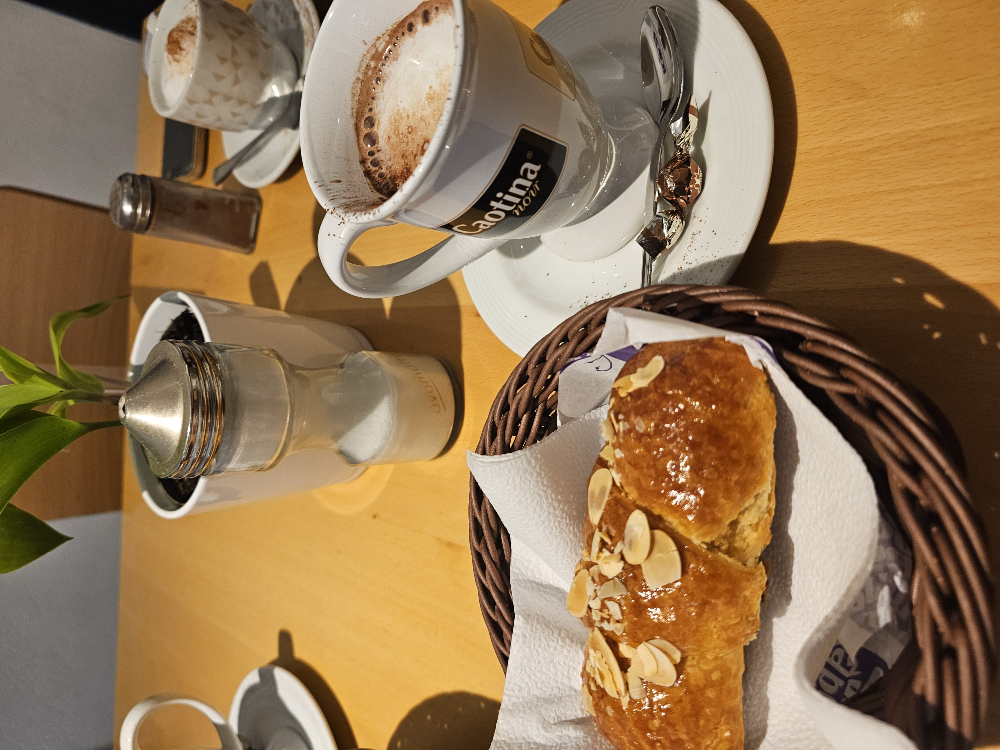
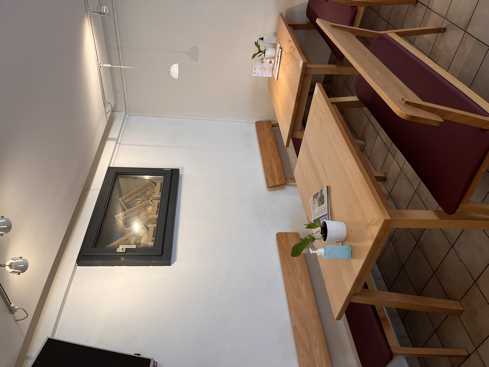

# Observation 03: Boulangerie du Grand-Saconnex (07.05.26)

 

# Atmosphere & Spatial Impression
- Pastries and breads are prominently displayed near the entrance, immediately framing the space around baked goods and consumption
- The bakery feels more spacious and structured than the café, with separate seating areas and a clearer division between customer and work spaces
- Soft instrumental jazz contributes to a calm atmosphere
- Interior design is minimal and coordinated: matching wooden furniture, tiled floors, and light-colored walls 
- The space feels organized and functional rather than personalized
- Audible kitchen and refrigeration sounds make the production aspect of the bakery more present
- Staff operate in coordinated routines across front and back areas, communicating through practical systems (Walkie-Talkies) 
- Homemade pastries and bread are emphasized as central products
- The surrounding neighborhood appears family-oriented and village-like, reinforcing a local customer base

---
 

# Customers Dynamics
- Clientele spans different age groups, though the atmosphere skews somewhat older and quieter
- Customer behavior is divided between quick transactional visits and short seated stays
- Visits appear relatively brief, suggesting the bakery functions more as a stopover than a prolonged social space
- Interactions remain contained within existing social groups; little exchange occurs between different tables or customers
- Staff interactions are warm and polite but noticeably more professional and distanced than in the café setting
- Communication follows conventional service roles rather than personal familiarity or informal social exchange

---
 

# Overall Character
- Compared to the café, the environment feels more consumption-oriented and time-regulated, with less emphasis on extended presence or communal intimacy
- The atmosphere balances warmth with efficiency, creating a welcoming but less socially immersive environment

---
 
 

  
  
  
  

