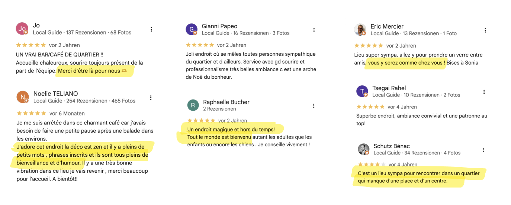
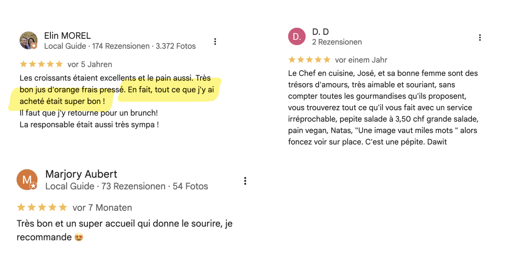
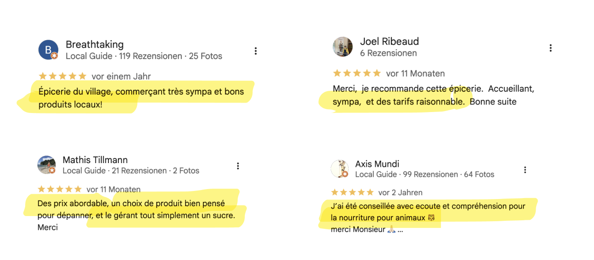
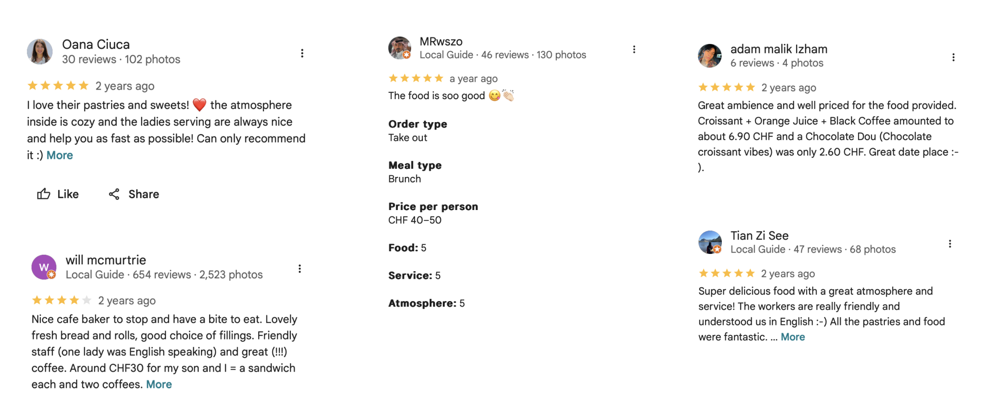

# First Impressions: Analysis of Online Google Reviews (29.04.26)

## 01 Café le jardin de Sonia
Reviews highlight: the atmosphere of the place, its detailed and playful interior, and its openness. The friendly team and the warm presence of Sonia (the owner), are frequently mentioned, with the café described as a welcoming neighbourhood meeting point.

## 02 Boulangerie du Grand-Saconnex
Reviews highlight: delicious self-baked pastries, as well as the kindness and positive attitude of the owner couple.

## 03 L’épicerie de Troinex
Reviews highlight: a strong focus on local, well-curated products, reasonable prices, and a friendly, welcoming owner.

## 04 Boulangerie de Montchoisy (Eaux-Vives)
Reviews highlight: good-quality pastries, fair pricing aligned with quality, a pleasant atmosphere, and a multilingual, inclusive experience.

