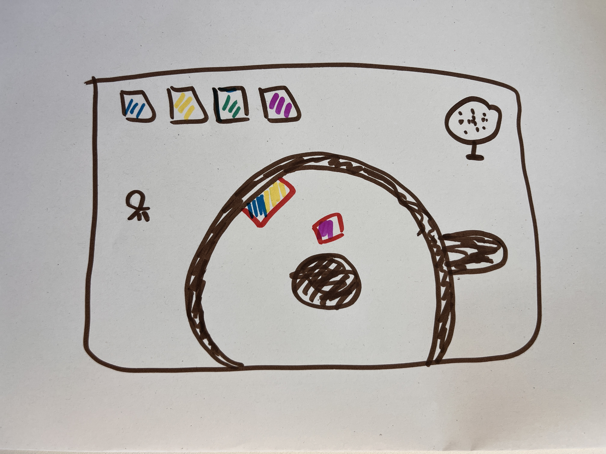
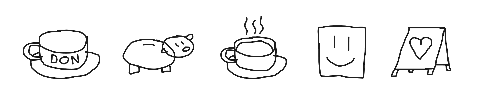
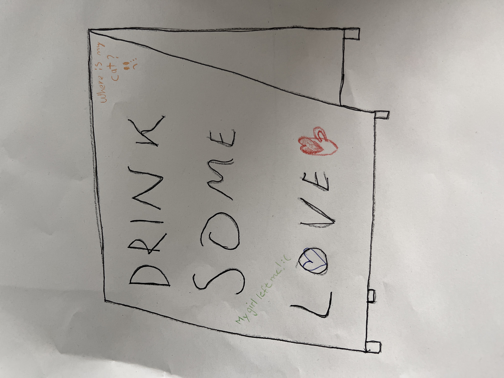

# Ideation Exercises (30.04.26)

## 01 World Exercise
TASK:  
Based on provided findings about our context “Bakery & Tearoom”, another team had 20 minutes to create a Zelda-style map.

RESULT: 
Users takes on the role of a little coffee bean and can interact with the world through a new perspective. By choosing different colors they influence and shape the taste and flavor profile of the coffee. 

 

## 02 Props
TASK:  
Ideate and draw one prop that represents a dilemma that could be present in the café, without any further explanation.

RESULT: 
 

Overview of the proposed props: 

Selected Idea: The café contains many small notes, messages, and signs that customers enjoy discovering while exploring the space. This inspired the idea of visitors leaving their own messages behind. The dilemma arises when some of these messages reveal a need for help, loneliness, or personal distress. How should the café owners respond? Should they treat such messages as jokes, ignore them, or take them seriously and intervene?  
