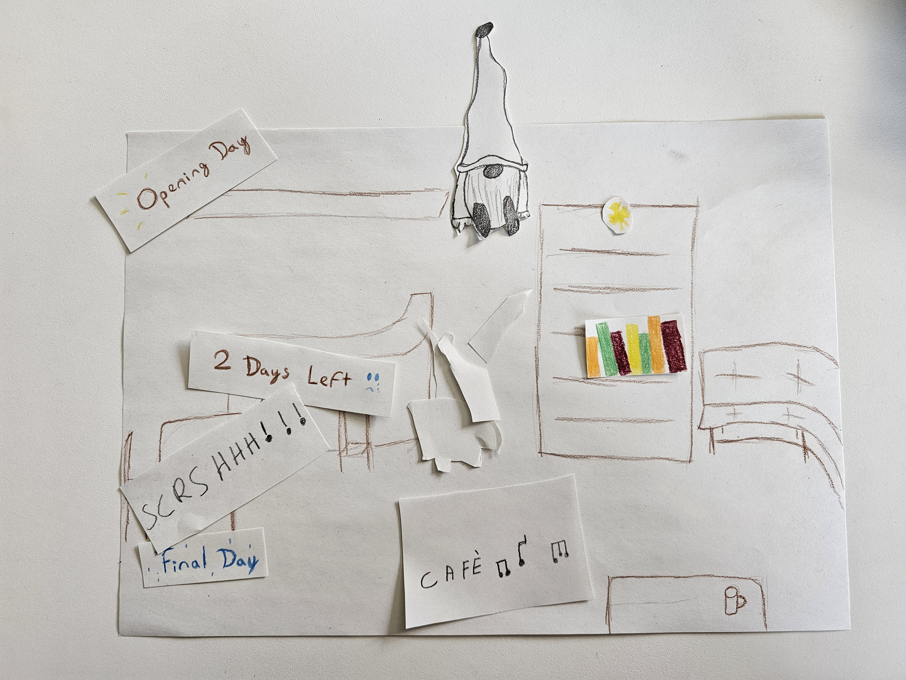
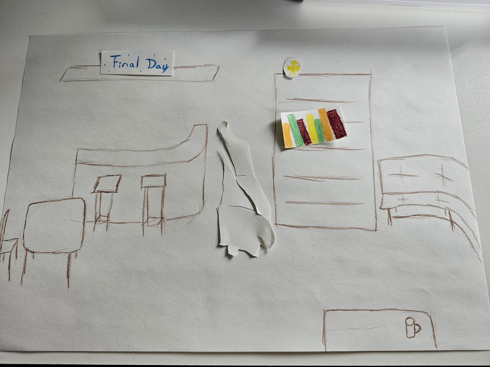

## Paper Prototype (18.05.26)

Paper prototyping allowed us to bring our first conceptual ideas to life. We sketched a preliminary layout of the café and placed cut-out objects on the shelves. One object is broken into shards, as the main interaction will involve repairing it.
 
Simple squares represent different time frames. Repairing the broken object by assembling each shard moves the story forward through time. How exactly this time advancement will be displayed is not clear at this stage.

 

