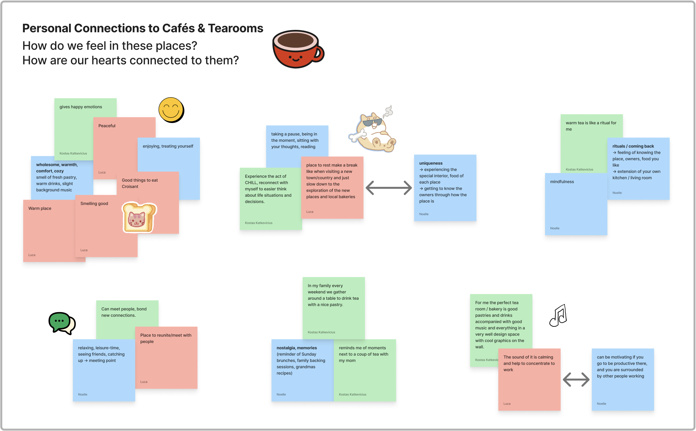

# Personal Experiences & Emotional Connection with Cafés & Tearooms (28.04.26)

 

First brainstorming session to collect our personal memories, emotions, and stories about cafés, and to explore what we have in common as well as where differences appear.

Why do we go to cafés? How do we feel in cafés? What do we notice and pay attention to? What is special for each of us in these experiences?

 

