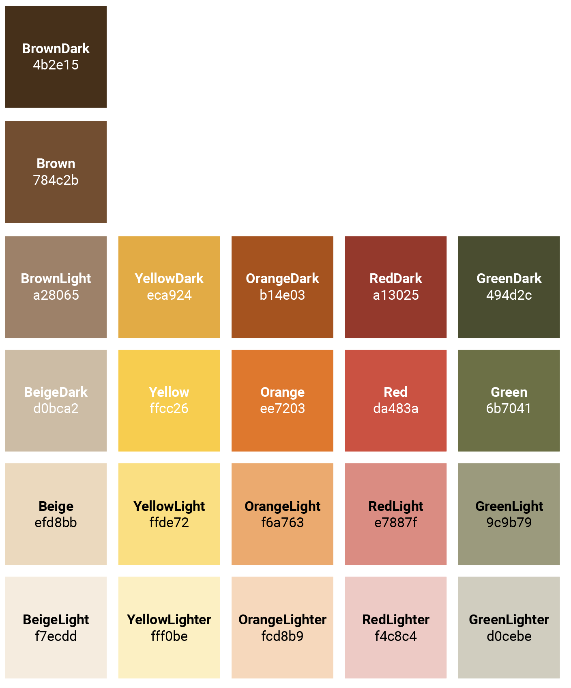

# Art Direction – Color Palette (02.06.26)

Our color palette consists of warm, earthy tones based on five main colors: golden yellow, vibrant burnt orange, terracotta red, olive green, and beige-brown. Variations are created by adding black and white to generate additional shades and sub-colors. This palette supports a coherent and warm visual style that reflects the character of the café and reinforces its welcoming atmosphere.

 

