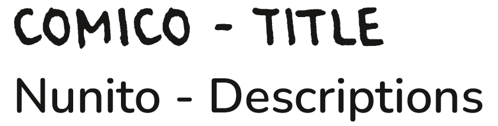

# Typography & App Logo (12.06.26)

The typography combines a more expressive, hand-drawn typeface for titles with a simpler, more readable font for object descriptions and smaller text elements. This creates a balance between personality and clarity.

The hand-drawn aesthetic is also reflected in the app logo, creating a consistent visual language across the experience.

 

Typography:

 

Logo Iterations (final choice on the left):

