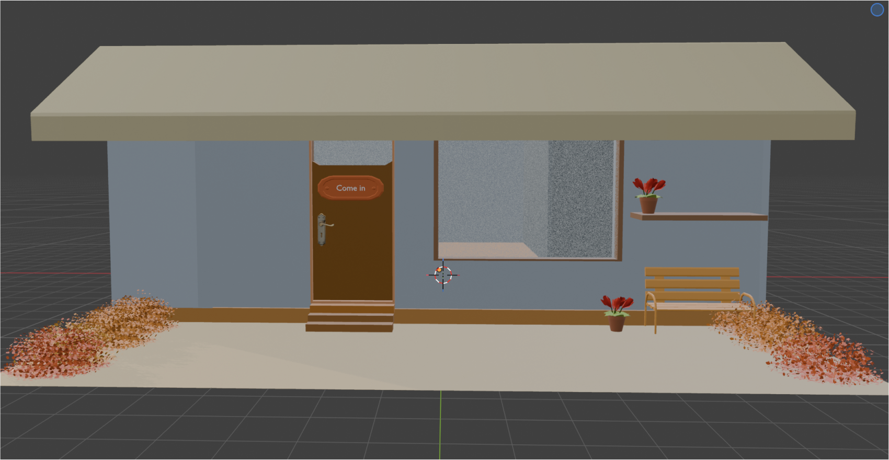
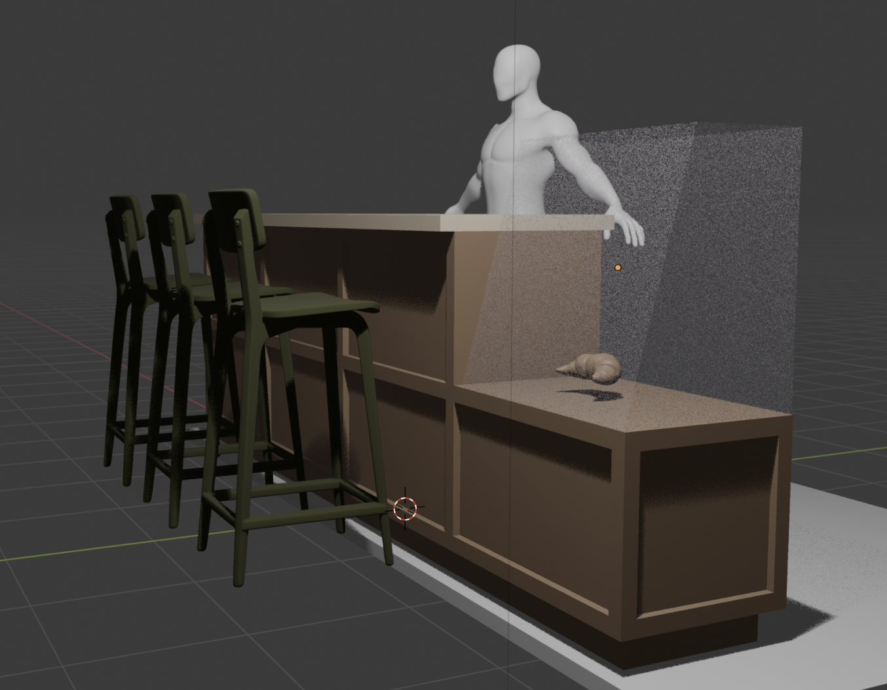
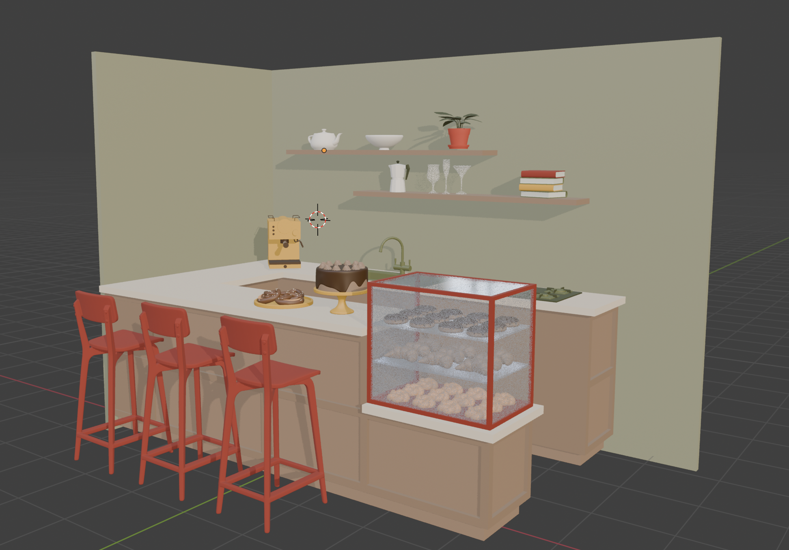
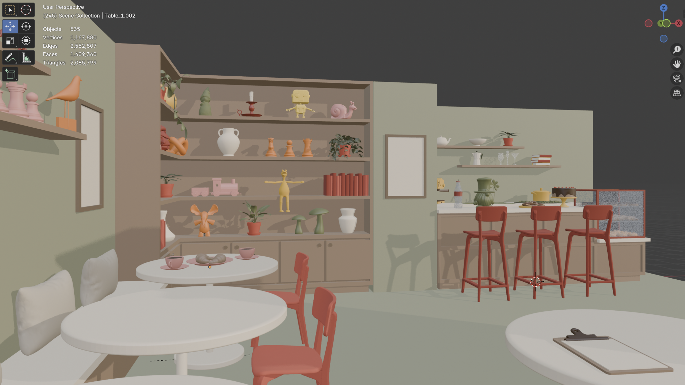
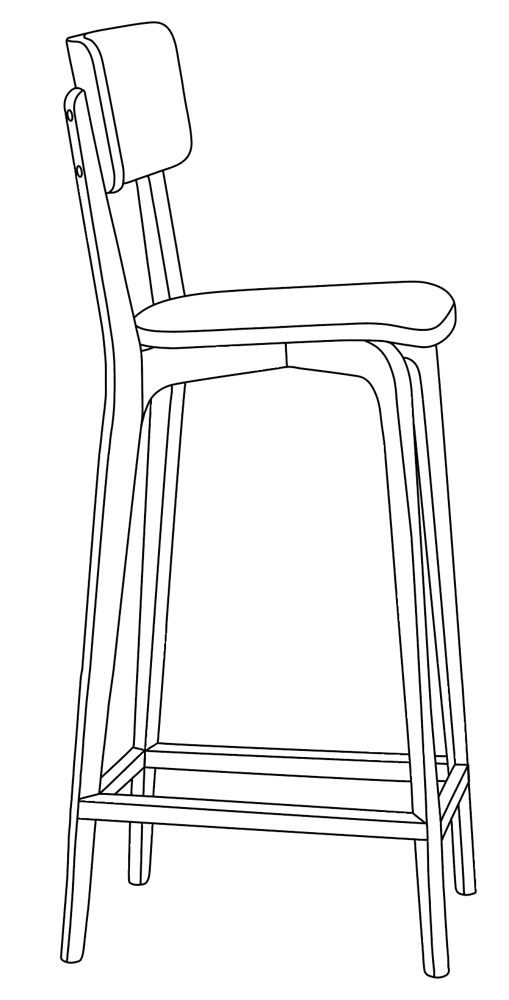
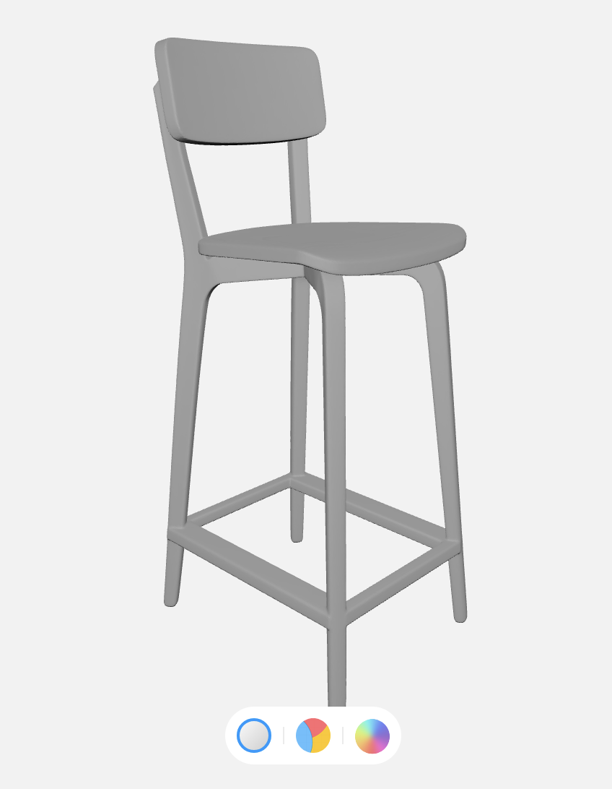
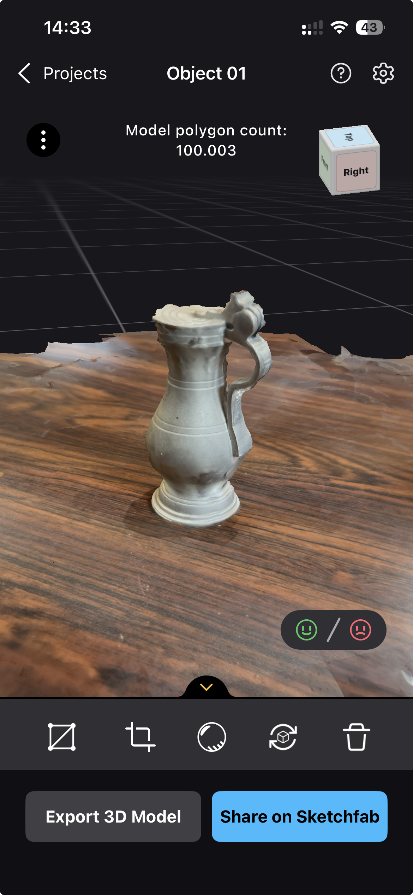
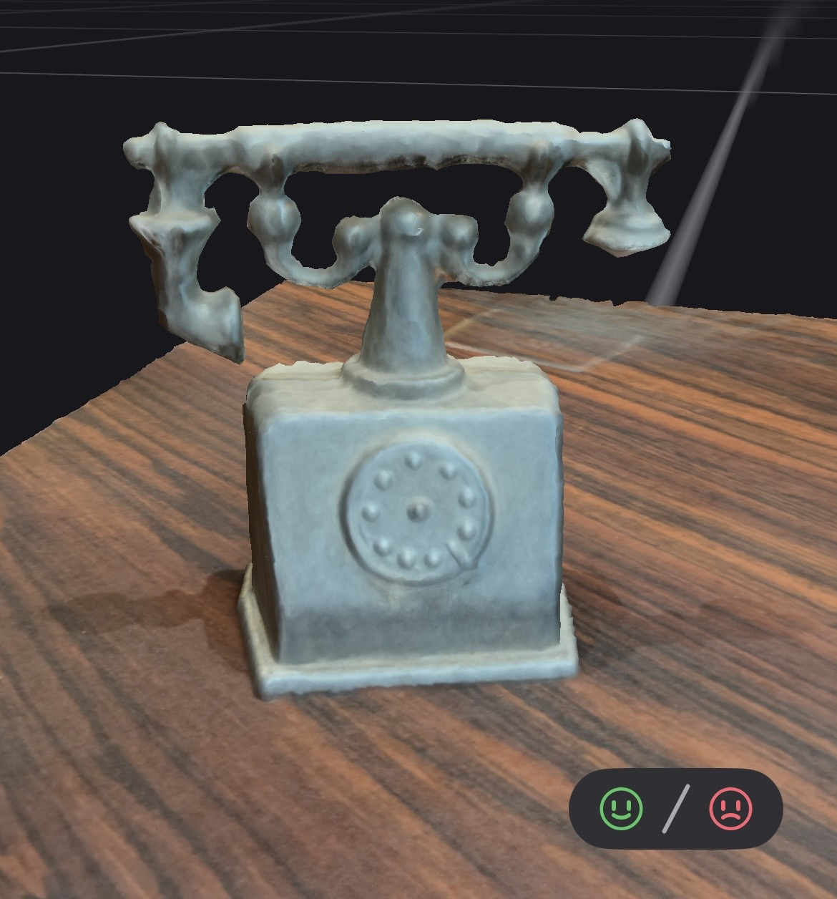

# 3D - Blender (03.06.26-10.06.26)

**Blender was used to model and layout the indoor café and the outdoor space.**

The furniture and objects were created using a combination of approaches:  
1 Individual modeling/building in Blender 
2 Generating 3D models with MakerLab (https://makerworld.com/de/makerlab) based on sketches or 2D images 
3 Scans of real-life objects from Café le Jardin de Sonia using the RealityScan app 
4 Free 3D assets, mainly from Sketchfab (see [CREDITS](../CREDITS.md)) 

 

Outside: first version 
 

 

Inside: process of building 
  

 

2 Makerlab 
 

 

3 Scans with RealityScan 
 

