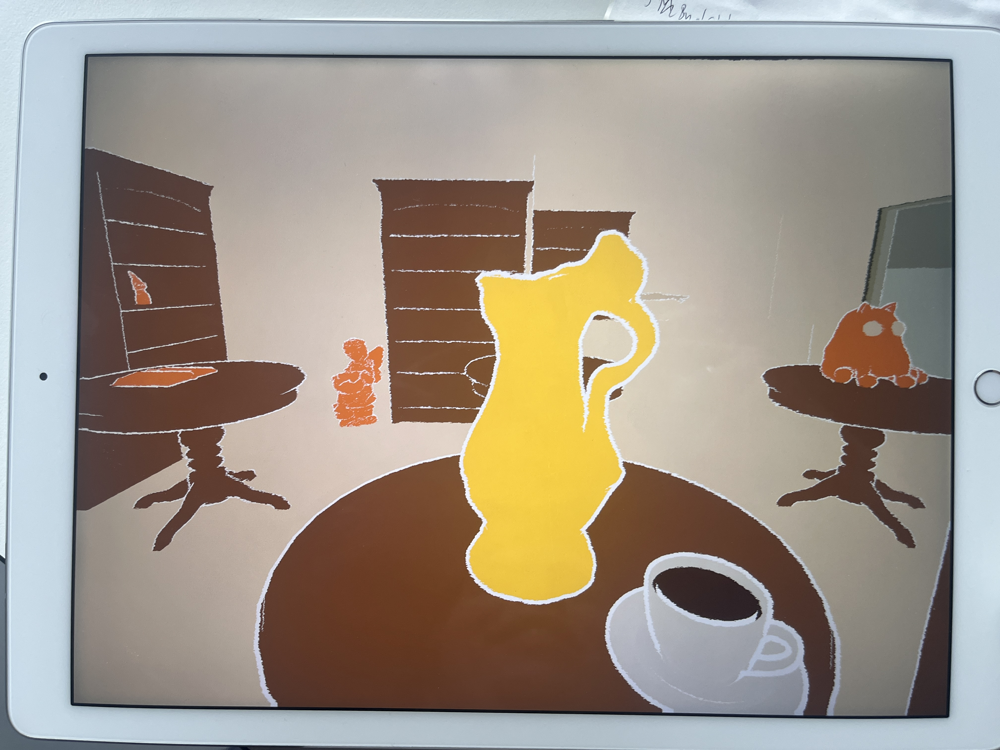

# User Tests 03 (10.06.26)

## Observations: Misunderstandings / Pain Points
 

**Scene: Inside the café**

*1.0 Initial Interaction* 
When entering the café (indoor,table scene), users’ first action is to click the yellow amphora instead of the coffee mug, since it is more prominent in both color and size.

*2.0 Audio Story Length* 
The audio stories are too long, leading to loss of attention.
→ Suggestion: limit them to a maximum of 15–20 seconds.

*3.0 Introduction & Ending* 
Suggestion to add an audio introduction and ending that provides more context. For example, once the user is at the table, the owner’s voice could say something like: “Hello, I am Maria. You’re new here, right?”

 

