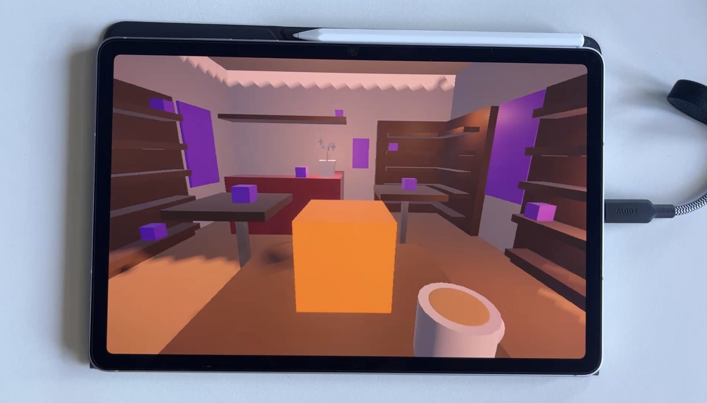
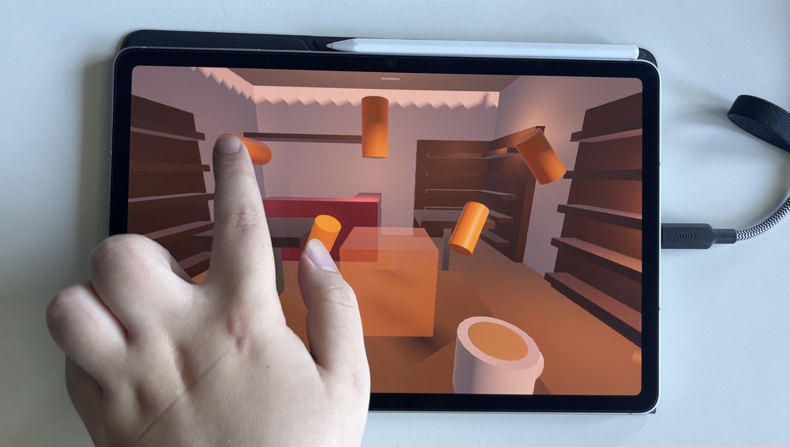
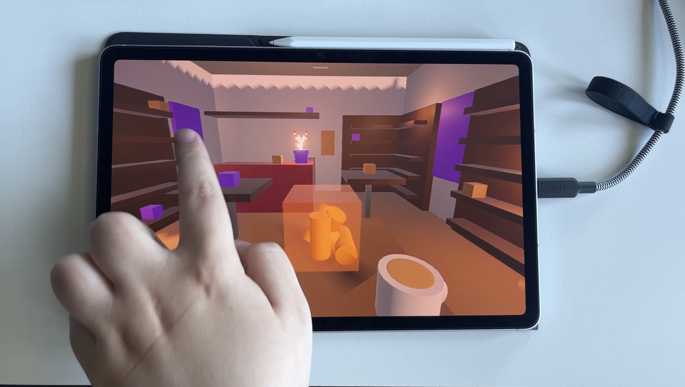

# User Tests 01 (22.05.26)

The first user tests were conducted directly with the initial greyboxing version. At this point, users could interact with the orange cube to break it. Subsequently, the resulting orange cylinders (representing the shards) could be placed into a transparent cube, where they would remain to reconstruct the broken object.

 

## Observations: Misunderstandings / Pain Points
 

**Scene 01: Object Breaking**

*1.1 Lack of clear starting interaction* 
Users did not understand that they must click the orange cube to initiate the experience.

*1.2 Misleading affordances on non-interactive objects* 
Users attempted to interact with the coffee mug instead of the orange cube.

+1.3 Premature scene activation via background elements* 
Clicking on the future positions of broken pieces (Scene 2 layout) triggered their early visibility. This created confusion.

 

**Scene 02: Object Repairing**

*2.1 Drag-and-drop interaction not discovered* 
Users did not immediately understand that the cylindrical pieces (shards) could be dragged and dropped, and instead attempted to click them.

*2.2 Goal of reconstruction unclear* 
Users did not understand that the pieces must be placed into the transparent cube to repair the broken object.

*2.3 Navigation issue after zoom-in* 
When zoomed into an object, users were unsure how to return to the previous view. → Lack of a clear “back” or reset mechanism.

v2.4 Over-interaction with non-interactive objects* 
Users attempted to click or zoom on yellow/brown background objects.
→ These objects appear interactive but do not respond to input.

 

