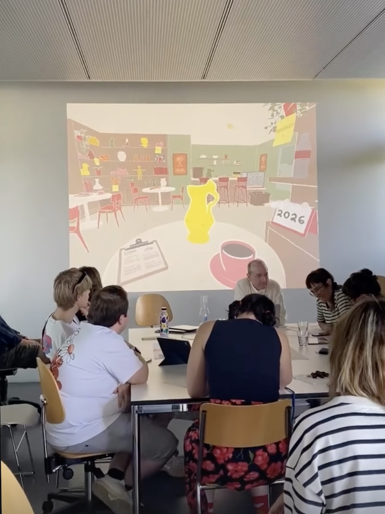

# Final Presentation: Concept & Protoype (16.06.26)

## Feedback (Aspects to change & add)
- Rename the café to “Café le Jardin de Sonia” as an homage to the real Sonia and her place. This will provide a clear connection to an existing place in Geneva that visitors may already recognize or discover through the experience.
- Optimize the size of the shards. Some pieces are currently too small, making the intended interaction less intuitive. Larger shards will help users more easily understand the initial task: drag and drop the pieces to repair the broken object.
- The object that breaks at the beginning could also have a story or special meaning, which is revealed to the user once it is fully repaired.

## Notes
- All experience content will be translated into French.
- Ideally stories would be recorded with the real Sonia and customers.